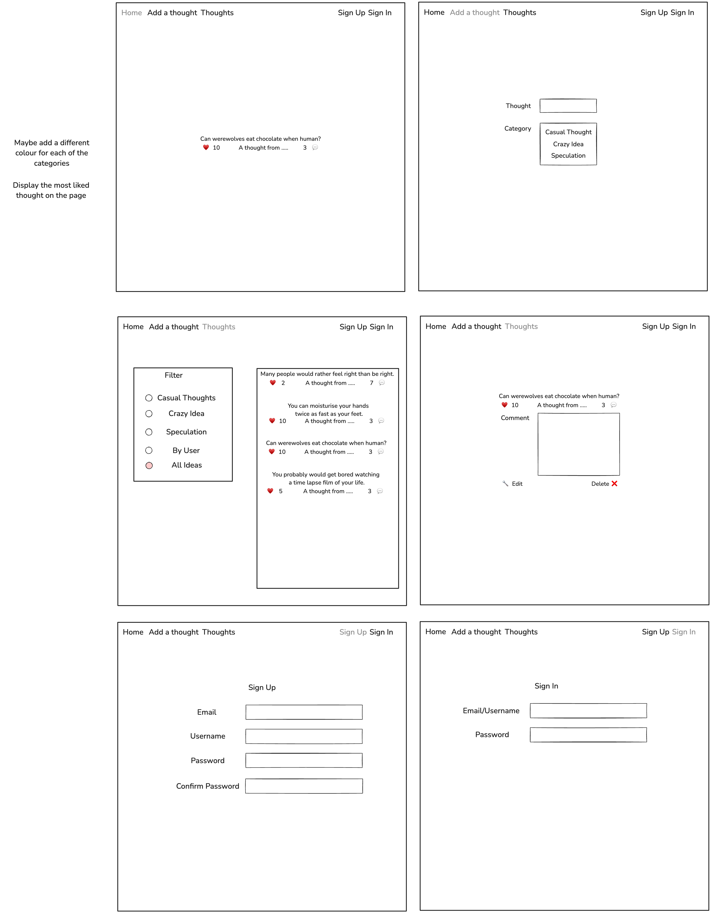
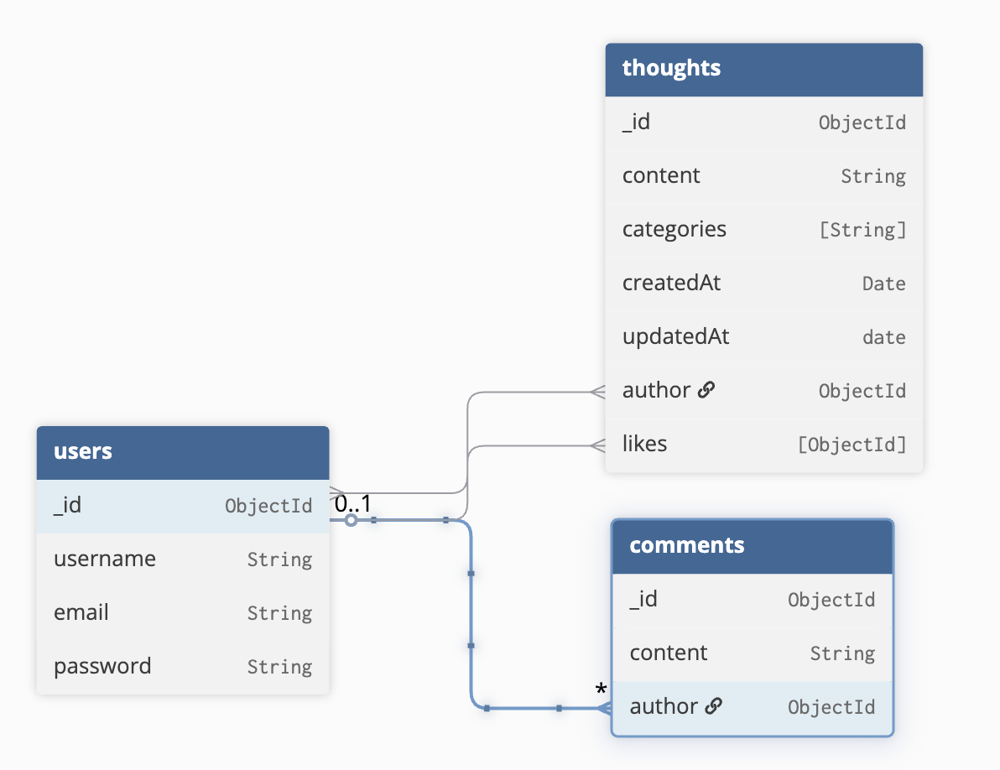

<h1 align="center">Shower Thoughts</h1>

# Description

At the end of our sixth week on the course we started to generate ideas for our second project. The project was to create a MEN stack CRUD app. 

# Deployment link

https://some-shower-thoughts.netlify.app/

# Getting Started/Code Istallation

  - Clone Repository
  - Open folder in Visual Studio Code
  - Run 'nodemon' in the termial
  - On the browser, head to http://localhost:3000/

# Timeframe & Working Team (Solo/Pair/Group)

This is a solo project and I started workin on it on the 17th April and finished on the 24th April

# Technologies Used

### Front End

  - CSS
  - JavaScript

### Back End

  - EJS including express, morgan, mongoose, methodOverride, express session, connect-mongo
  - Visual Studio Code
  - GitHub
  - NPM, Node.js

# Brief

- The app utilizes EJS Templates for rendering views to users.
- The app uses session-based authentication.
- The app’s files are organized following the conventions taught in lectures.
- The app has at least one data entity in addition to the User model. At least one entity must have a relationship with the User model.
- The app has full CRUD functionality.
- Authorization is implemented in the app. Guest users (those not signed in) should not be able to create, update, or delete data in the application or access functionality allowing those actions.
- The app is deployed online so that the rest of the world can use it.

# Planning

### Wireframe


### ERD



# Build/Code Process

### Error Route

```
app.get('/{*any}', (req, res) => {
    return res.status(404).render('404.ejs')
})
```

A small part but I also feel is an important part was adding a error route. I feel like it was simple to add but it meant that if the user went to the wrong url or the user timed out it would take them to a page to show that something went wrong and what to do next. This is important in making the site easy to navigate and understand.

### Profile Route

```
import express from 'express'
import Thought from '../models/Thought.js'
import User from '../models/User.js'
import isSignedIn from '../middleware/isSignedIn.js'

const router = express.Router()

router.get('/profile', isSignedIn, async (req,res) => {
    try {
        const authoredThoughts = await Thought.find({author: req.session.user._id})
        const likedThoughts = await Thought.find({likes: req.session.user._id})
        console.log(authoredThoughts)
        return res.render('users/profile.ejs', {
            authoredThoughts,
            likedThoughts
        })
    } catch (error) {
        console.log(error)
    }
})

export default router
```

I wanted to create a page which only appears and can only be navigated to when the user is signed in. This paged showed the thoughts which that user created and thoughts that they have liked. This was simple to add but I feel it is needed when there are loads of different ones and you want to find ones which you have added. I did this by having a authoredThoughts variable and finding all the related thougths which have the same author as the users id, the same for likes but your finding the likes which are the same as the user id.

# Challenges

### Random Thought

The toughest part of this project was something I thought would be relativly simple to add but it was the random thought for the home page. I initially thought of having a seperate route but considering I wanted it on the home page it made sense to add it here.

```
app.get('/', async (req, res) => {
        try {
            const randomThoughts = await Thought.aggregate([{$sample: {size: 1}}, {$lookup: {
                from: "users",
                localField: "author",
                foreignField: "_id",
                as: "authorDetails"
            }}])

            
            console.log(randomThoughts[0])
            
            return res.render('index.ejs', {
                thought: randomThoughts[0],
                author: randomThoughts[0].authorDetails[0]
            })
            
            
        } catch (error) {
            console.log(error)
        }
})
```
Through a lot of trial and error I came across `.aggregate` and by adding `{$sample: {size: 1}}` it selects a random thought from my thought collection. I then use 
```
{$lookup: {
  from: "users",
  localField: "author",
  foreignField: "_id",
  as: "authorDetails"
}}
```
Using this allowed me to get all the imformation out of the thought so on the hope page it shows the user, how many likes and importantly the thought.


# Wins


I feel think I enjoyed how the styling worked for my project and the overall asthetics. It was very close to how I pictured it, I wanted it to be quite a clean site so that it was easy to navigate. I also wanted a simple colour palette because I didn't want to overwhelm the user and I believe that I have achived that.

# Key Learnings/Takeaways


I believe that I made the right choice in picking this site as I really enjoyed the idea and it motivated me to try and make it look as nice as possible. 

  - EJS: As this was my first solo project using EJS, I found that I was getting more and more comfortable with it and I found it quite easy to understand
  - Models: I was quite nervous starting out as I didn't know how the different models will work together but having that time just to test it out and make mistakes helped a lot and I feel like it made sense.


# Future Improvements

  - I want to add a filter where you can select thoughts based on their categories
  - Check thoughts of other users
  - Along with the random thought, adding the most liked thought of the day

